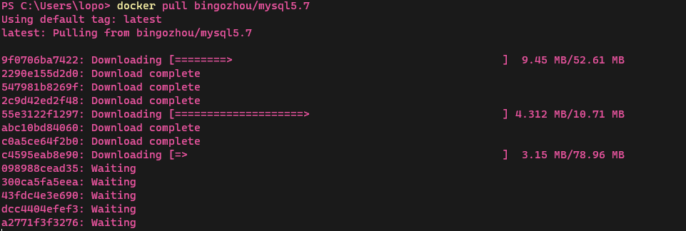
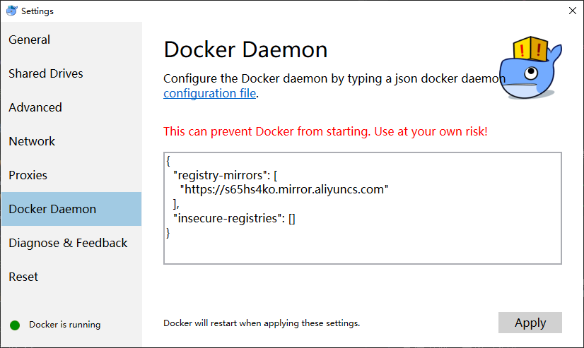
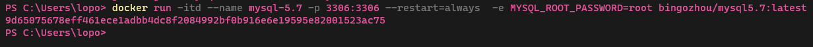
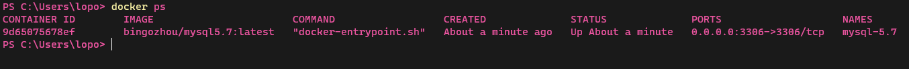
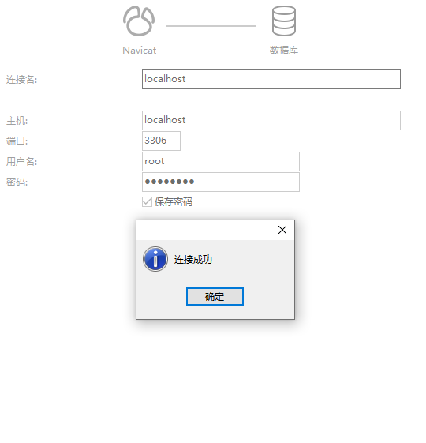

## 1,下载对应docker镜像

> 我这里使用的是mysql5.7版本
```shell
docker pull docker pull bingozhou/mysql5.7
```

> 这里等待下载完成即可，如果觉得下载速度慢，可以更换国内的阿里镜像  
> 我这里是windows的配置，复制粘贴过去即可
> <https://s65hs4ko.mirror.aliyuncs.com>


> 这个就是刚刚下载的镜像了

 
## 2,启动一个mysql容器
> mysql的默认端口是3306，这里我们没必要去改动他，直接映射过来就好  
> 直接下面一条命令搞定
```shell
docker run -itd --name mysql-5.7 -p 3306:3306 --restart=always  -e MYSQL_ROOT_PASSWORD=root bingozhou/mysql5.7:latest
```
> 这里再解析一下参数 
> - -name 为容器命名
> - -p    容器的端口映射
> - --restart=always    docker启动时自动启动这个容器
> - -e    设置环境变量，在这里时设置了root账户的登录密码  

> 看到返回了一串字符串说明创建成功
> 

 
> 接下来先看下我们容器



> ok,现在来连接数据库吧, 登录密码就是我们-e后面的参数，我这里设置的root, 
> 用户名也是root



> done......