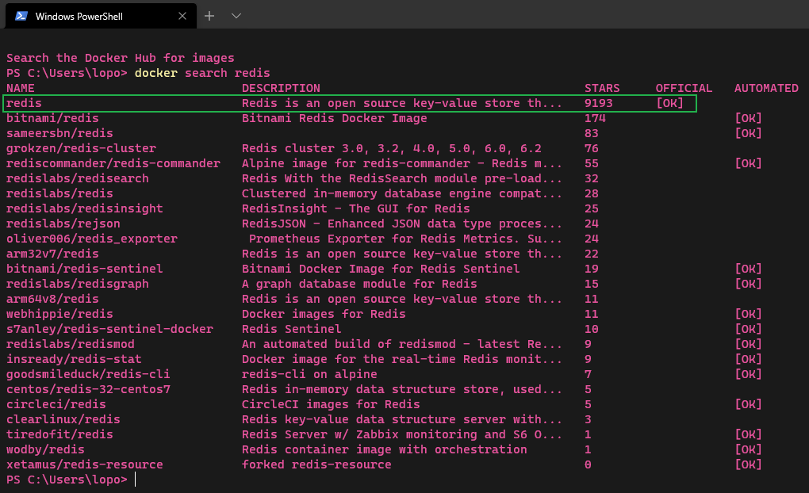
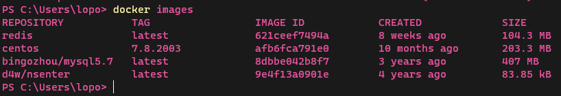
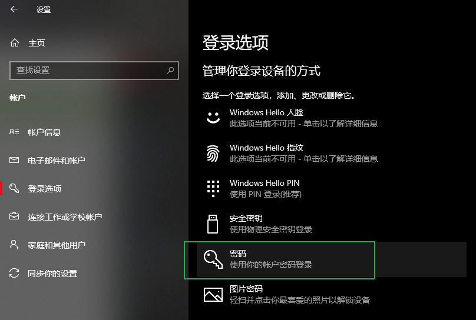
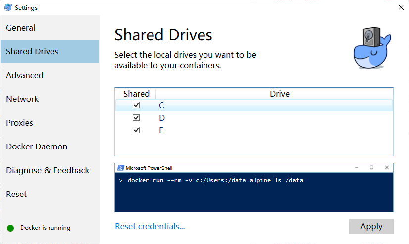
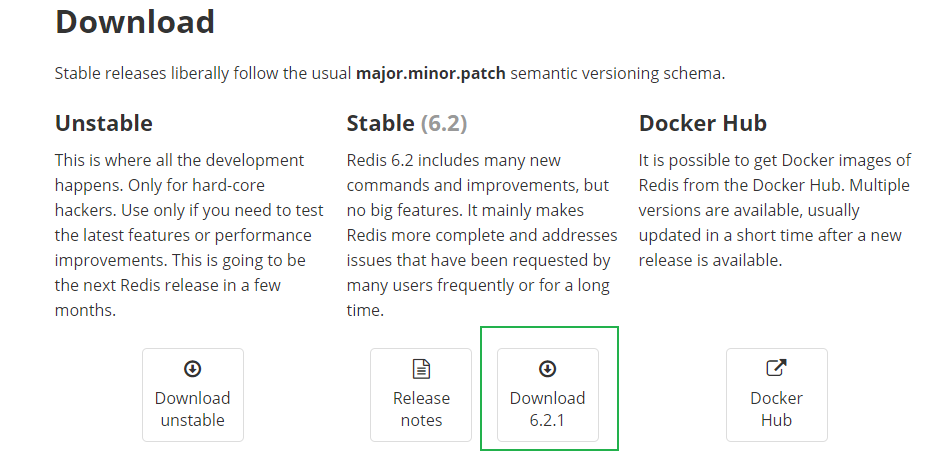
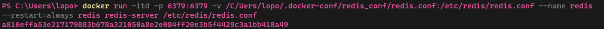
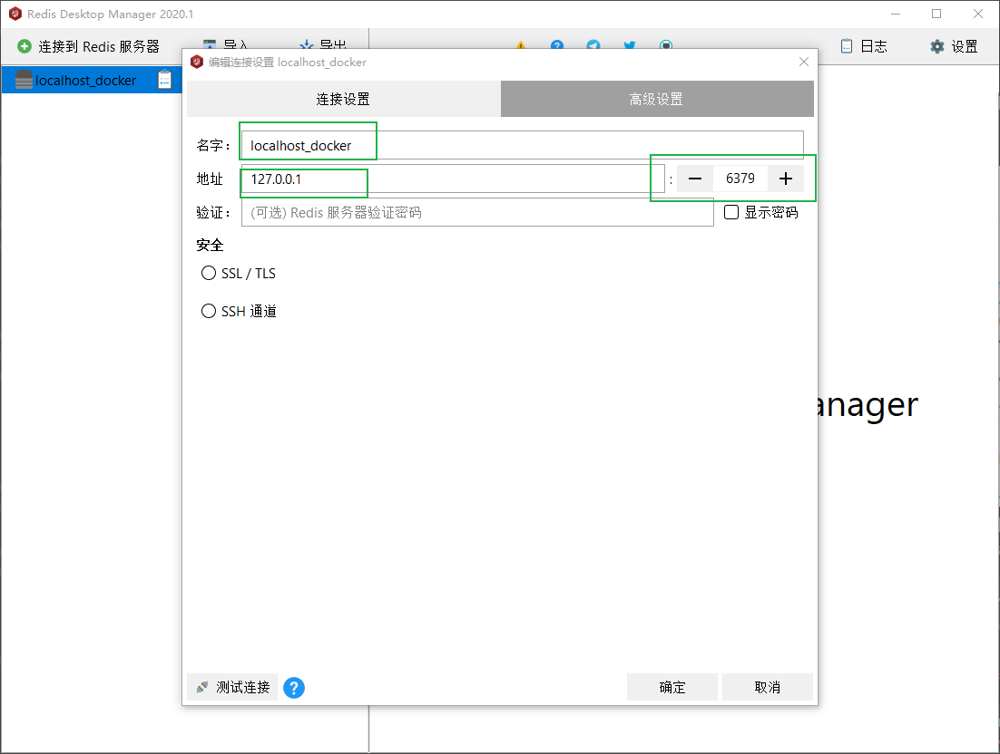
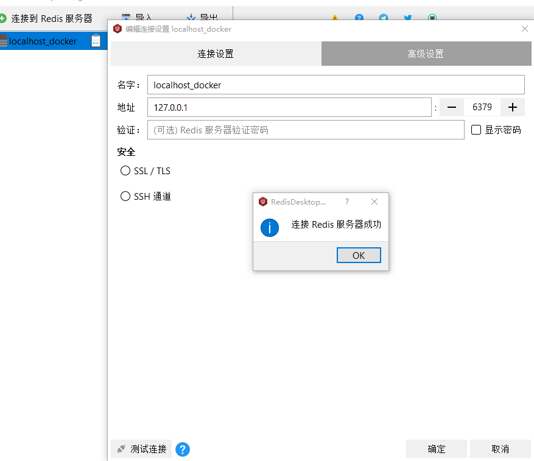

### 下载redis镜像

> 1, 先搜索一下看看

```shell
docker search redis
```



> 2，一般我们选第一个stars最多的下载

```shell
docker pull redis
```
> 3，再看一下下载好了没


### 配置windows映射文件
如果是linux用户的话，省略这一步，直接开始创建容器  
> 1，电脑设置开机密码，随便设自己记住就好

  
> 2，进入docker设置界面，Shared Drives，下面是你电脑中的所有磁盘，都勾上点击Apply，等待docker重启


### 创建启动容器
> 1，因为需要将配置文件与docker中的配置文件进行映射，第二步就是在windows中配置映射所需要的设置  
直接去 [Redis官网](https://redis.io/download) 下载配置文件



> 2，下载这压缩文件并解压缩，将redis.conf文件复制到本地计算机的任意位置，我这里为了方便管理放在了
C:\Users\lopo\.docker-conf\redis_conf\redis.conf

3，开始创建容器
```shell
docker run -itd -p 6379:6379 -v /c/User/lopo/.docker/redis_conf/redis.conf:/etc/redis/redis.conf --restart=always --name redis redis-server /etc/redis/redis.conf
```
> 命令比较长，你需要理解每个参数的作用



> -p 端口映射,将容器的6379映射到本地的6379    
-v 将容器的/etc/redis/redis.conf映射到本地/c/User/lopo/.docker/redis_conf/redis.conf  
--restart=always 这个容器在docker启动时自动启动  
--name 容器的名字  
redis-server /etc/redis/redis.conf   使用指定的配置文件启动redis-server  
至此，我们redis就已经启动  
通过RedisDesktopManager图形化工具连接



> 名字:随便取  
地址:127.0.0.1  
端口:6379
验证空的
点击 测试连接 弹出连接成功即可  

